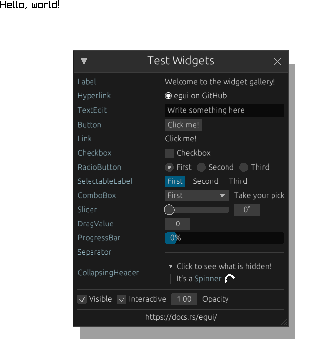

# egui-raylib
Raylib integration for [egui](https://github.com/emilk/egui).
The primary use case for this crate is a drop-in GUI library for 2D games made in Raylib.

# Dependencies
1. [raylib-rs](https://github.com/raylib-rs/raylib-rs): Rust-bindings for Raylib.
2. egui

# Unimplemented Features
The following features will not be supported in this integration:
1. Rendering arbitrary meshes using `Mesh` shapes.
2. `PaintCallback`s.
 
The primary reason behind this is that this integration does not rely on egui to tessellate its entire UI-mesh, but rather traverses the output shape tree and calls corresponding raylib functions on a draw handle. If necessary, these features can be obtained by using egui's built-in tessellation functionality to generate primitives that can be rendered directly. This approach was not chosen to allow the ui to be rendered on any draw handle that supports clipping.
